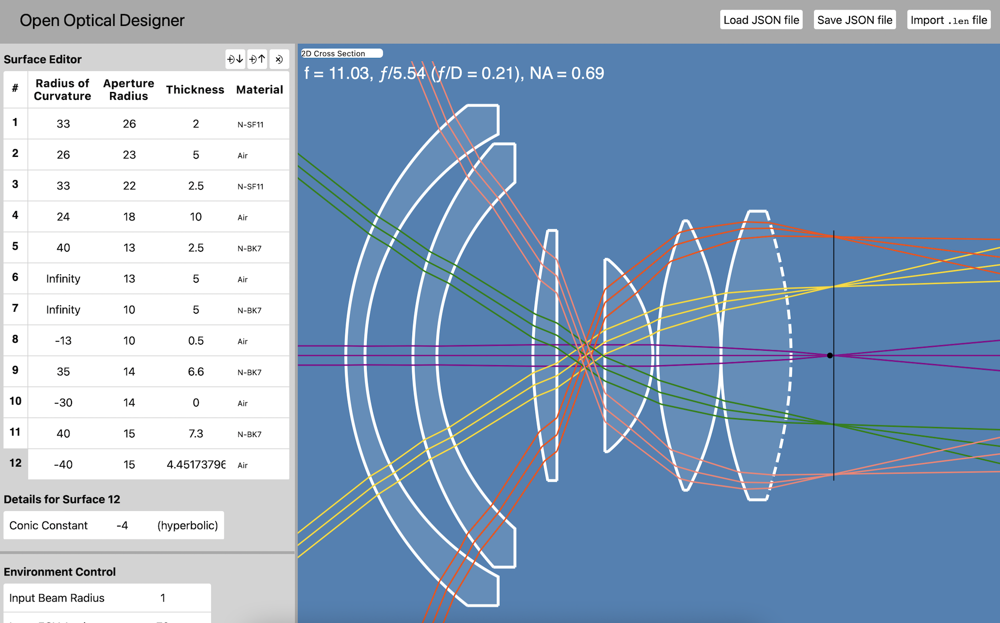
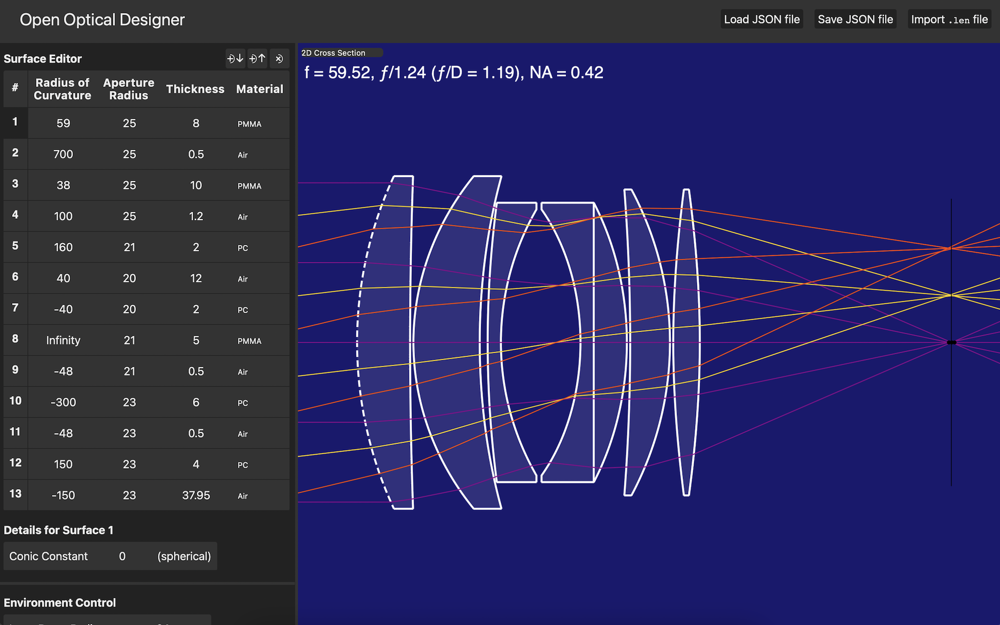

# Open Optical Designer

Alexander Bock

## Introduction

This is a work-in-progress web application for
designing optical lenses consisting of sequential lens elements.
It is intended to support practical design of, for
example, a large aperture double Gauss lens for a full frame camera with
effective control of image aberrations. Support for mirrors
and the design of reflecting telescopes is planned in the future.

## Features

* Full geometrical ray tracing simulated in 3D
* Aspherical surfaces (conic constant)
* Incoming ray environment control
* Automatic 2D cross section viewport
* Geometric point spread function (spot diagram)
* Display of focal length, effective f-number, and numerical aperture
* Autofocus
* Optical path length and phase
* Axial and transverse chromatic aberration
* Transverse ray aberration
* Material database
* Save/load designs as local JSON files
* Import designs from ".len" files
* Light and dark UI color schemes

## Future Plans

* Optimization
* Overall surface transmission for unpolarized light
* Field curvature
* Distortion
* Abbe sine condition
* Wavefront analysis
* Modulation transfer function graph
* Define surface properties in terms of a formula
* Through-the-lens scene simulation (test chart, astronomical, custom photo with optional depth map)
* Integrate high-resolution lens element model export for computer-controlled manufacturing (currently a separate program written in C++)
* Mirrors (including systems such as catadioptric telescopes)
* Design generators/wizards (singlet, achromatic doublet, telescope objective, spherical best form lens, etc.)
* Example designs (achromatic doublet, double Gauss, Cooke triplet, historical lenses, etc.)
* Material browser

## Potential Future Considerations

* Even-degree polynomial terms added to aspherical surfaces
* Anti-reflective coatings
* Tolerances
* Export standard element drawing PDFs for commercial manufacturing

## Notes

### Aspherical Surfaces

Open Optical Designer supports centered, symmetrical, aspherical surfaces of revolution from curves of the form:

$$ z(y) = \frac{y^2}{R + \sqrt{R^2-(K+1)y^2}} $$

defined by the radius of curvature $R$ and the conic constant $K$. The intersection of a ray with
surfaces defined in this manner is implemented using direct evaluation of the exact solutions for
the intersection of the surface with a parameterized line. The additional even-degree polynomial terms
(${A_4}y^4 + {A_6}y^6  + {A_8}y^8 + {A_{10}}y^{10}$ etc.) used for more complex aspherical surfaces are
not currently supported because a more complex procedure is required to determine ray intersections in
the absence of an algebraic solution for the parameter of an intersecting line. The `derivations`
directory contains artifacts from the process of finding these solutions for reference.

### Units

Design parameters use generic measurement units, but designs generally
follow a standard such as considering units equivalent to millimeters. Inputs
and outputs that require specific units (such as the design center wavelength
in micrometers) are labeled appropriately.

### Saving and Loading Files

The "Save JSON File" button will download the current lens design as a JSON file.
Depending on your browser settings, this may prompt for a location and name to save
the file or immediately save the file in your downloads directory with the default name (lens-design.json).
The "Load JSON File" button can be used to load a lens design that was previously saved
to a local file. JSON project files contain both the lens design and the environment settings.

### Importing ".len" Files

The ".len" file import feature imports design surfaces and recognizes the following
surface parameters:

* Radius of curvature
* Aperture radius
* Thickness
* Material
* Conic constant

## Development

### Implemented Using Standard Web Technologies With No External Dependencies

This software does not utilize any external or third-party dependencies,
fonts, images, packages, or frameworks.
It is written in plain, modern JavaScript as a single page application
using standard HTML and CSS with no build, preprocessing, generation, or
transformation steps. It can be run directly in the browser locally
without a web server if desired.

## Copyright

See COPYRIGHT.txt.

## License

See LICENSE.txt.
